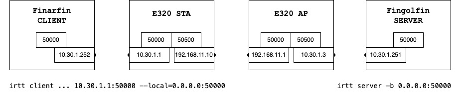

# On the WiFi station:

Make sure the wifi connection to the access point is established. We assume the ip of the station is `192.168.11.10` on `wlan0`.

1. Disable default route
```
ip route del default
```

2. Enable ip forwarding 
```
echo 1 > /proc/sys/net/ipv4/ip_forward
```

3. Setup forward path (from client to server)
```
iptables -t nat -A PREROUTING -i eth0 -d 10.30.1.1 -p udp --dport 50000 -j DNAT --to-destination 192.168.11.1:50000
iptables -t nat -A POSTROUTING -o wlan0 -s 10.30.1.252 -p udp --dport 50000 -j SNAT --to 192.168.11.10:50500
```

4. Setup backward path (from server to client)
```
iptables -t nat -A PREROUTING -i wlan0 -d 192.168.11.10 -p udp --dport 50500 -j DNAT --to-destination 10.30.1.252:50000
iptables -t nat -A POSTROUTING -o eth0 -s 192.168.11.1 -p udp --dport 50000 -j SNAT --to 10.30.1.1:50000
```

Check NAT table
```console
root@mango_wlan_linux_E320:~$ iptables -t nat -L -n -v
Chain PREROUTING (policy ACCEPT 0 packets, 0 bytes)
 pkts bytes target     prot opt in     out     source               destination         
   17   633 DNAT       udp  --  eth0   *       0.0.0.0/0            10.30.1.1            udp dpt:50000 to:192.168.11.1:50000
    0     0 DNAT       udp  --  wlan0  *       0.0.0.0/0            192.168.11.10        udp dpt:50500 to:10.30.1.252:50500

Chain INPUT (policy ACCEPT 0 packets, 0 bytes)
 pkts bytes target     prot opt in     out     source               destination         

Chain OUTPUT (policy ACCEPT 0 packets, 0 bytes)
 pkts bytes target     prot opt in     out     source               destination         

Chain POSTROUTING (policy ACCEPT 0 packets, 0 bytes)
 pkts bytes target     prot opt in     out     source               destination         
    4   136 SNAT       udp  --  *      wlan0   10.30.1.252          0.0.0.0/0            udp dpt:50000 to:192.168.11.10:50500
    0     0 SNAT       udp  --  *      eth0    192.168.11.1         0.0.0.0/0            udp dpt:50000 to:10.30.1.1:50000
```

If using the script, config json should be like this:
```json
{
  "protocol": "udp",
  "client": {
    "ip": "10.30.1.252",
    "port": "50000"
  },
  "sta": {
    "client_port": "50000",
    "ap_port": "50500"
  },
  "ap": {
    "ip": "192.168.11.1",
    "sta_port": "50000"
  }
}
```

# On the WiFi access point:

1. Enable ip forwarding 
```
echo 1 > /proc/sys/net/ipv4/ip_forward
```

2. Setup forward path (from client to server)
```
iptables -t nat -A PREROUTING -i wlan0 -d 192.168.11.1 -p udp --dport 50000 -j DNAT --to-destination 10.30.1.251:50000
iptables -t nat -A POSTROUTING -o eth0 -s 192.168.11.10 -p udp --dport 50000 -j SNAT --to 10.30.1.3:50500
```

3. Setup backward path (from server to client)
```
iptables -t nat -A PREROUTING -i eth0 -d 10.30.1.3 -p udp --dport 50500 -j DNAT --to-destination 192.168.11.10:50500
iptables -t nat -A POSTROUTING -o wlan0 -s 10.30.1.251 -p udp --dport 50000 -j SNAT --to 192.168.11.1:50000
```

Show tables
```console
root@mango_wlan_linux_E320:~$ iptables -t nat -L -n -v
Chain PREROUTING (policy ACCEPT 0 packets, 0 bytes)
 pkts bytes target     prot opt in     out     source               destination         
    4   134 DNAT       udp  --  wlan0  *       0.0.0.0/0            192.168.11.1         udp dpt:50000 to:10.30.1.251:50000
    0     0 DNAT       udp  --  eth0   *       0.0.0.0/0            10.30.1.3            udp dpt:50500 to:192.168.11.10:50500

Chain INPUT (policy ACCEPT 0 packets, 0 bytes)
 pkts bytes target     prot opt in     out     source               destination         

Chain OUTPUT (policy ACCEPT 0 packets, 0 bytes)
 pkts bytes target     prot opt in     out     source               destination         

Chain POSTROUTING (policy ACCEPT 0 packets, 0 bytes)
 pkts bytes target     prot opt in     out     source               destination         
    4   134 SNAT       udp  --  *      eth0    192.168.11.10        0.0.0.0/0            udp dpt:50000 to:10.30.1.3:50500
    0     0 SNAT       udp  --  *      wlan0   10.30.1.251          0.0.0.0/0            udp dpt:50000 to:192.168.11.1:50000
```

If using the script, config json should be like this:
```json
{
  "protocol": "udp",
  "server": {
    "ip": "10.30.1.251",
    "port": "50000"
  },
  "ap": {
    "server_port": "50500",
    "sta_port": "50000"
  },
  "sta": {
    "mac_addr": "40:d8:55:04:20:19",
    "ip": "192.168.11.10",
    "ap_port": "50500"
  }
}
```


Check each table with line number
```
iptables -t nat -v -L -n --line-number
iptables -t mangle -v -L -n --line-number
iptables -t filter -v -L -n --line-number
```

Delete a rule with line number
```
iptables -t nat -D PREROUTING {rule-number-here}
iptables -t mangle -D PREROUTING {rule-number-here}
iptables -t filter -D PREROUTING {rule-number-here}
```


## NC
```
nc -u -l 50000
nc -u 10.30.1.1 50000
```

## IRTT
```
irtt server -b 0.0.0.0:50000
irtt client -i 100ms -d 10s -l 172 --fill=rand 10.30.1.1:50000 --local=0.0.0.0:50000
```
